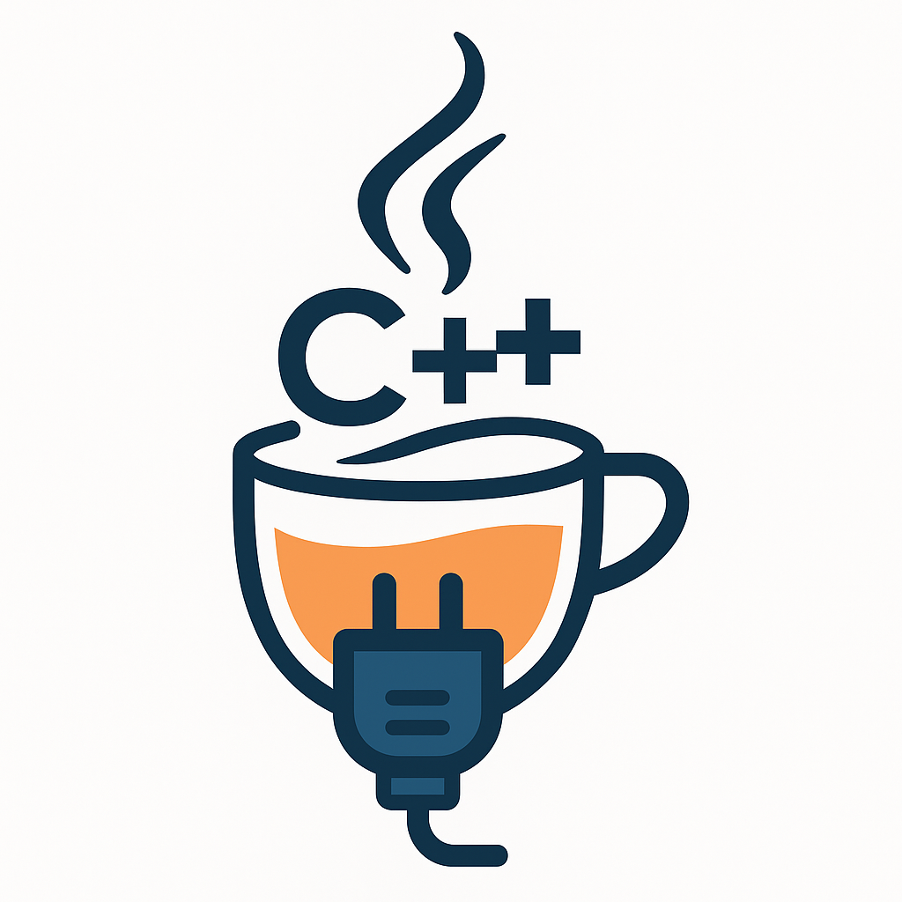

# jsocketpp: Modern C++17 Cross-Platform Socket Library

[](https://github.com/MangaD/jsocketpp/actions)
[](https://github.com/MangaD/jsocketpp/actions/workflows/doxygen-gh-pages.yml)
[](LICENSE)
[](https://conan.io/center/jsocketpp)
[](https://vcpkg.io/en/packages.html#jsocketpp)

**Java-style sockets for modern C++17. Cross-platform, robust, and simple.**

<div align="center">

</div>

---

## Overview

`jsocketpp` is a C++17 cross-platform socket library inspired by the Java networking API. It offers familiar and
convenient classes (`Socket`, `ServerSocket`, `DatagramSocket`, `MulticastSocket`, etc.) to simplify TCP and UDP network
programming in C++. The API is designed to be clear, robust, and portable—ideal for modern, high-performance C++
applications.

- **Cross-platform**: Windows, Linux, macOS
- **Supports**: TCP, UDP, and UNIX domain sockets
- **Easy-to-use** Java-style interface
- **Modern C++17** features

---

## Features

- Object-oriented socket abstractions (like Java)
- Blocking and non-blocking operations, timeouts
- IPv4 and IPv6 support
- Exception-based error handling
- Internal buffer management
- Optional thread safety
- Support for broadcast and multicast
- Clean RAII resource management
- Unit tested with GoogleTest

---

## Installation

### vcpkg

```sh
vcpkg install jsocketpp
```

### Conan

```sh
conan install jsocketpp/[latest]@
```

### Manual

Clone and add to your project:

```sh
git clone https://github.com/MangaD/jsocketpp.git
cd jsocketpp
mkdir build && cd build
cmake ..
make
sudo make install
```

---

## Quick Start

### TCP Example

```cpp
#include <jsocketpp/Socket.hpp>
#include <jsocketpp/ServerSocket.hpp>

int main() {
    // Start a server with address reuse and 5s accept timeout, auto-bind/listen
    ServerSocket server(8080, {}, true, true, 5000);
    // (bind() and listen() are called automatically)

    Socket client = server.accept();
    std::string msg = client.read<std::string>();
    client.write("Hello from server!");
}
```

### UDP Example

```cpp
#include <jsocketpp/DatagramSocket.hpp>
#include <jsocketpp/DatagramPacket.hpp>

int main() {
    DatagramSocket socket(12345); // Bind to port 12345
    socket.bind();

    DatagramPacket packet(1024);
    socket.read(packet); // Receives data and fills `packet`

    // Echo it back to sender
    socket.write(packet);
}
```

---

## Java-Inspired API

| Java              | jsocketpp                    |
|-------------------|------------------------------|
| `Socket`          | `jsocketpp::Socket`          |
| `ServerSocket`    | `jsocketpp::ServerSocket`    |
| `DatagramSocket`  | `jsocketpp::DatagramSocket`  |
| `DatagramPacket`  | `jsocketpp::DatagramPacket`  |
| `MulticastSocket` | `jsocketpp::MulticastSocket` |

---

## Documentation

* [Full API Reference](https://github.com/MangaD/jsocketpp/wiki)

---

## Building & Testing

```sh
cmake --preset=debug
cmake --build --preset=debug
ctest --preset=debug
```

---

## License

MIT License. See [LICENSE](LICENSE).

---

## Contributing

Pull requests are welcome! Please read the [contributing guidelines](CONTRIBUTING.md).

---

## Acknowledgements

* Java’s networking API for inspiration
* GoogleTest for unit tests
* All contributors and users!
